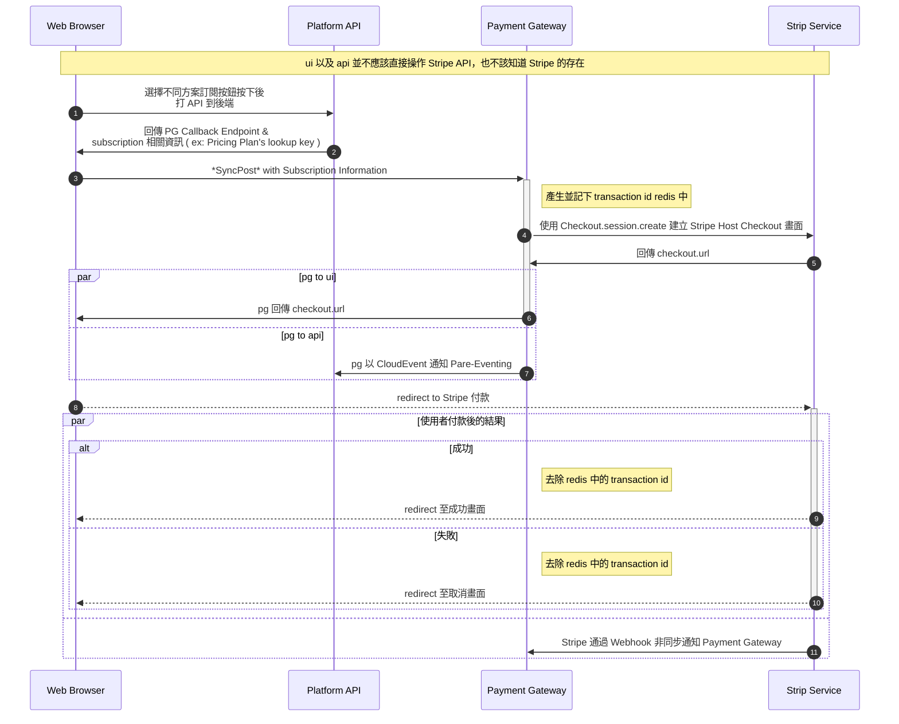
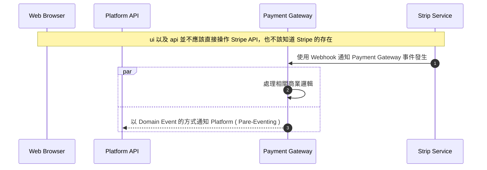
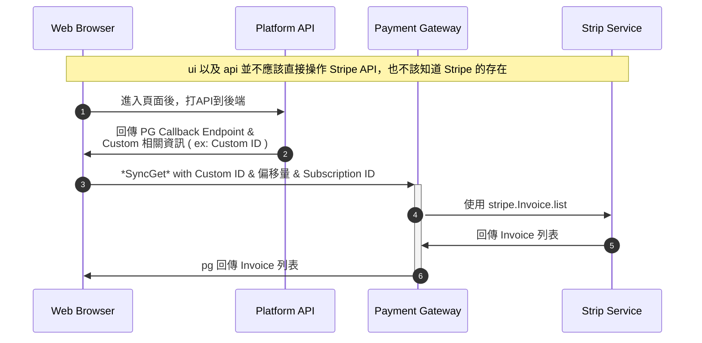
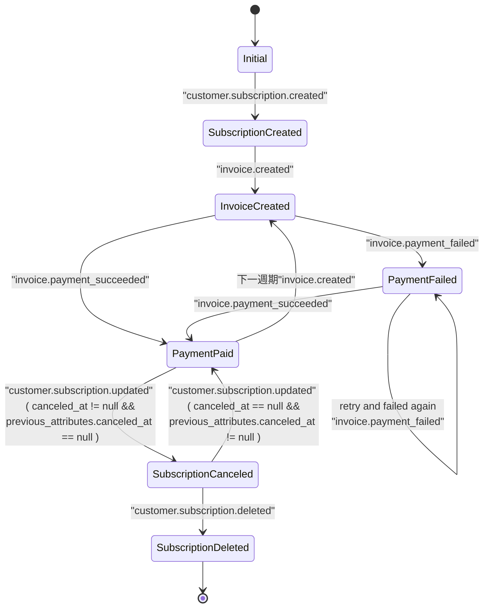

# 訂閱按鈕按下後的付款流程



# 接收 Stripe Webhook 事件




# 取得 Billing & Payment History 流程




# Payment Gateway 狀態圖



RAPD Events:  
SubscriptionCreated  
InvoiceCreated  
PaymentPaid  
PaymentFailed  
SubscriptionDeleted  

Stripe Events:
customer.subscrption.created
invoice.created
invoice.payment_failed
invoice.payment_succeeded
customer.subscription.deleted


---

# UML Class Diagram

```mermaid
classDiagram

    direction LR

    %%%%%%% 關係定義

    PaymentService <|-- StripePaymentService
    PaymentRepository <|-- StripePaymentRepository


    BaseState <|-- InitialState
    BaseState <|-- SubscriptionCreatedState
    BaseState <|-- InvoiceCreatedState
    BaseState <|-- PaymentPaidState
    BaseState <|-- PaymentFailedState
    BaseState <|-- SubscriptionCancaledState
    BaseState <|-- SubscriptionDeletedState

    InitialState <|-- StripeInitialState
    SubscriptionCreatedState <|-- StripeSubscriptionCreatedState
    InvoiceCreatedState <|-- StripeInvoiceCreatedState
    PaymentPaidState <|-- StripePaymentPaidState
    PaymentFailedState <|-- StripePaymentFailedState
    SubscriptionCancaledState <|-- StripeSubscriptionCancaledState
    SubscriptionDeletedState <|-- StripeSubscriptionDeletedState

    StripePaymentService o-- PaymentRepository
    StripePaymentService o-- DababaseService
    StripePaymentService o-- PareEventingService
    StripePaymentService o-- redis_cached_storage
    StripePaymentService o-- JWTIssuer
    StripePaymentService o-- StateMachineAbstract
    StateMachineAbstract o-- BaseState
    StripePaymentService *-- CloudEvent

    BaseState o-- PaymentRepository
    BaseState o-- DababaseService
    BaseState o-- PareEventingService
    BaseState o-- redis_cached_storage


    %%%%%%% 物件定義

    class StateMachineAbstract {
        __state

        -get_state_obj()
        +handle_event()
        +inject()
    }

    class PaymentRepository {
        <<interface>>
        +get_next_period_first_day()
        +get_customer()
        +create_customer()
        +get_subscription()
        +get_price_item()
        +create_customer_portal_configuration()
        +create_customer_portal()
        +create_payment_link()
        +create_product()
        +create_price_for_product()
    }
    class StripePaymentRepository { }

    class PaymentService {
        <<interface>>
        +handle_webhook_event()
        +get_customer_billing_portal()
        +create_checkout_url()
        +create_customer()
        +create_product()
        +create_priceplan_for_product()
        +create_product()
        +create_priceplan_for_product()
    }
    class StripePaymentService { }


    class BaseState {
        <<interface>>
        -payment_repo
        -database
        -event_services
        -redis_cache_storage

        +handle()
        +get_event_register(event: dict) Self
    }
    class InitialState { }
    class SubscriptionCreatedState { }
    class InvoiceCreatedState { }
    class PaymentPaidState { }
    class PaymentFailedState { }
    class SubscriptionCancaledState { }
    class SubscriptionDeletedState { }

    class StripeInitialState { }
    class StripeSubscriptionCreatedState { }
    class StripeInvoiceCreatedState { }
    class StripePaymentPaidState { }
    class StripePaymentFailedState { }
    class StripeSubscriptionCancaledState { }
    class StripeSubscriptionDeletedState { }


    %% 用於資料庫存放的字串
    class PaymentTransactionState {
        <<Enumeration>>
        SubscriptionCreated
        InvoiceCreated
        PaymentFailed
        PaymentPaid
        SubscriptionDeleted
    }
｀

    %% 原本就存在的物件
    %% Container 中的 SharedContainer 中的 database
    class DababaseService { }
    class PareEventingService { }
    class redis_cached_storage { }
    class CloudEvent { }
    class JWTIssuer { }
```
<!-- 
    class EventDispatcher {
        + handlers

        +register_handler(event, handler: Type~EventHandler~)
        +dispatch_event(event)
    } -->

---

```mermai
sequenceDiagram
    participant web as Web Browser
    participant blog as Blog Service
    participant account as Account Service
    participant mail as Mail Service
    participant db as Storage


    Note over web,db: The user must be logged in to submit blog posts
    web->>+account: Logs in using credentials
    account->>db: Query stored accounts
    db->>account: Respond with query result

    alt Credentials not found
        account->>web: Invalid credentials
    else Credentials found
        account->>-web: Successfully logged in

        Note over web,db: When the user is authenticated, they can now submit new posts
        web->>+blog: Submit new post
        blog->>db: Store post data

        par Notifications
            blog--)mail: Send mail to blog subscribers
            blog--)db: Store in-site notifications
        and Response
            blog-->>-web: Successfully posted
        end
    end
```


---

之後要 publish 到 pare-eventing 的時候要放 token
因此要嘛用前端帶的 access_token 要嘛用 jwt_issuer.issue 產的 token


這邊可以看到 jwt_issuer.issue 發 token 的方法
payload 裡面目前隨便放也都可以
/Users/henryli/coding/pentiumnetwork/mavis-auto-platform/mavis-auto/modules/events/api/endpoint.py

這邊定義了 jwt_issuer 被 container provider 實體化的地方
/Users/henryli/coding/pentiumnetwork/mavis-auto-platform/mavis-auto/application/containers/shared_mod.py

這邊定義了 pare_eventing_svc.publish 的方法
/Users/henryli/coding/pentiumnetwork/mavis-auto-platform/mavis-auto/modules/events/domain/infra/pare_eventing_service.py